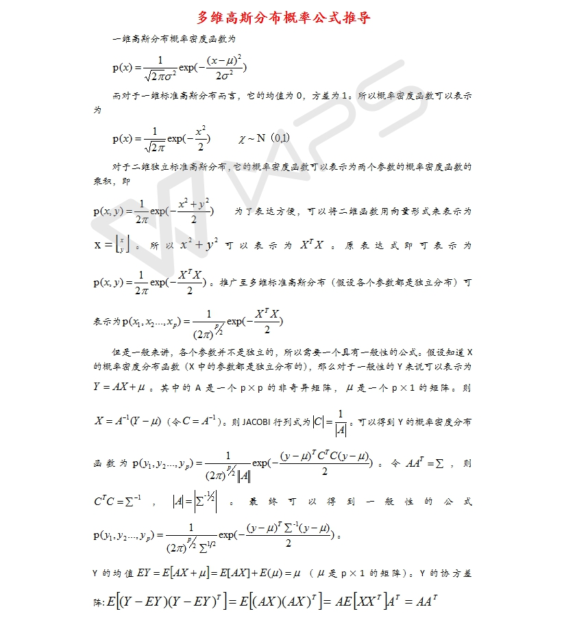

## 基本知识自测题

- #### 1.有线性方程$\boldsymbol{Ax}=\boldsymbol{b}$,若已知$\boldsymbol{A},\boldsymbol{ b}$,需要求解$\boldsymbol{x}$,该如何求解?这对$\boldsymbol{A}$和$\boldsymbol{b}$有哪些要求?

总结一下Ax=b 有解的条件:
- 行的角度：如果方程组系数矩阵A的行向量的线性组合可以生成 $0$ 向量，那么相同的组合作用在b的分量上，也必须得到 $0$。
- 列向量的角度：b 必须是 A 各列向量的线性组合。
- 列空间角度：当且仅当 b 属于 A 的列空间时成立。

[参考](https://zhuanlan.zhihu.com/p/44114447)

- #### 2. 高斯分布是什么?它的一维形式是什么样子?它的高维形式是什么样子?

[参考](https://blog.csdn.net/WheneverLH/article/details/79497267)

- #### 3. 学习Vim

[参考](https://www.runoob.com/linux/linux-vim.html)
