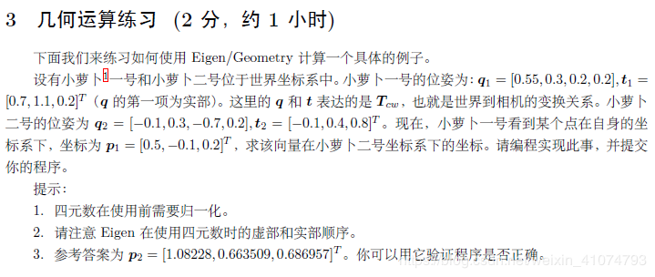

## 笔记
### 一、熟悉 Eigen 矩阵运算
本次习题,你需要使用 Eigen 库,编写程序,求解一个线性方程组。为此,你需要先了解一些有关线性方程组数值解法的原理。
设线性方程$\boldsymbol{A} \boldsymbol{x}=\boldsymbol{b}$,在 $\boldsymbol{A} $ 为方阵的前提下,请回答以下问题:
- 1. 在什么条件下,$\boldsymbol{x}$ 有解且唯一?
- 2. 高斯消元法的原理是什么?
- 3. QR 分解的原理是什么?
- 4. Cholesky 分解的原理是什么?
- 5. 编程实现 $\boldsymbol{A} $  为 100 × 100 随机矩阵时,用 QR 和 Cholesky 分解求 $\boldsymbol{x}$的程序。

####  1. 在什么条件下,$\boldsymbol{x}$ 有解且唯一?
n元非齐次线性方程组$A_{m \times n} x=b$
- $R(A) \neq R(B)  \Leftrightarrow A x=b$无解
- $R(A)=R(B)=n \Leftrightarrow A x=b$有唯一解
- $ R(A)=R(B)< n \Leftrightarrow A x=b $有无穷多解

#### 2. 高斯消元法的原理是什么?
[参考](https://en.wikipedia.org/wiki/Gaussian_elimination)
通过用初等行变换将增广矩阵化为行阶梯阵，然后通过回代求解线性方程组的解。原理是将方程组中每个方程含有的未知数的个数降到最低，并且最下面的方程含有的未知数的个数最少。
$$
\left[\begin{array}{rrrr}{1} & {3} & {1} & {9} \\ {1} & {1} & {-1} & {1} \\ {3} & {11} & {5} & {35}\end{array}\right] \rightarrow\left[\begin{array}{rrr|r}{1} & {3} & {1} & {9} \\ {0} & {-2} & {-2} & {-8} \\ {0} & {2} & {2} & {8}\end{array}\right] \rightarrow\left[\begin{array}{rrr|r}{1} & {3} & {1} & {9} \\ {0} & {-2} & {-2} & {-8} \\ {0} & {0} & {0} & {0}\end{array}\right] \rightarrow\left[\begin{array}{rrr|r}{1} & {0} & {-2} & {-3} \\ {0} & {1} & {1} & {4} \\ {0} & {0} & {0} & {0}\end{array}\right]
$$

#### 3. QR 分解的原理是什么?
[参考](https://zh.wikipedia.org/wiki/QR%E5%88%86%E8%A7%A3)
把矩阵分解成一个列向量正交矩阵与一个上三角矩阵的积。原理是将矩阵每个列作为一个基本单元，将其化为正交的基向量与在这个基向量上的投影长度的积。
$$
\begin{array}{l}{\text { Any real } m \times n \text { matrix } \mathrm{A} \text { can be decomposed into }} \\ {\qquad \mathbf{A}=\mathbf{Q} \mathbf{R}} \\ {\text { where } \mathbf{Q} \text { is an } m \times m \text { orthogonal matrix }\left(\mathbf{Q}^{T} \mathbf{Q}=1\right) \text { and } \mathbf{R} \text { is an }} {m \times n \text { upper triangular matrix. }}\end{array}
$$

#### 4.Cholesky 分解的原理是什么?
将一个**对称正定矩阵**分解成一个下三角矩阵与其共轭转置之乘积。
$$
\begin{array}{l}{\text { Let a real matrix } \mathbf{A} \text { is }} \\ {\text { symmetric: } \mathbf{A}^{T}=\mathbf{A}} \\ {\text { positive definite: } \mathbf{x}^{T} \mathbf{A} \mathbf{x}>0 \quad \forall \mathbf{x} \in \mathbb{R}^{m}} \\ {\text { Then }} \\ {\text { where L is a lower triangular matrix. }}\end{array}
$$
解线性方程组
$$
\begin{array}{l}{\text { If } \mathrm{A} \text { is symmetric and positive definite, then }} \\ {\qquad \mathrm{Ax}=\mathrm{b}} \\ {\text { is solved via } \mathrm{A}=\mathrm{LL}^{T}, \text { and }} \\ {\qquad \begin{aligned} \mathrm{Ly}=\mathrm{b} & \text { (forward substitution) } \\ \mathrm{L}^{T} \mathrm{x}=\mathrm{y} & \text { (back substitution) } \end{aligned}}\end{array}
$$

#### 5.编程实现 $\boldsymbol{A} $  为 100 × 100 随机矩阵时,用 QR 和 Cholesky 分解求 $\boldsymbol{x}$的程序。
注意:Eigen 固定大小矩阵最大支持到 50,所以超过50就要用动态的.
``` c++
#include <iostream>

using namespace std;

#include <Eigen/Core>
#include <Eigen/Dense>

using namespace Eigen;

#define MATRIX_SIZE 100

int main() {
    MatrixXd A_p = MatrixXd::Random(MATRIX_SIZE, MATRIX_SIZE);
    MatrixXd A = A_p.transpose() * A_p;  // 构造对称正定阵
    VectorXd b = VectorXd::Random(MATRIX_SIZE);
    VectorXd x = A.colPivHouseholderQr().solve(b);  // QR 分解求解
    VectorXd y = A.llt().solve(b);  // cholesky 分解求解
    cout << "Ax=b方程解x=" << x << endl;
    cout << "Ay=b方程解y=" << y << endl;

    return 0;
}
```
### 二、几何运算练习


``` C++
#include <iostream>
#include <cmath>
#include <Eigen/Core>
#include <Eigen/Geometry>

using namespace std;
using namespace Eigen;

int main(int arcg,char** argv)
{
    Quaterniond q1 = Quaterniond(0.55,0.3,0.2,0.2).normalized();   //定义并归一化四元数
    Quaterniond q2 = Quaterniond(-0.1,0.3,-0.7,0.2).normalized();
    Vector3d t1 ,t2,p1,p,p2;
    t1 << 0.7,1.1,0.2;
    t2 << -0.1,0.4,0.8;
    p1 << 0.5,-0.1,0.2;
  

    Isometry3d T_cw1 = Isometry3d::Identity();
    T_cw1.rotate ( q1 );
    T_cw1.pretranslate ( t1 );

    Isometry3d T_cw2 = Isometry3d::Identity();
    T_cw2.rotate ( q2 );
    T_cw2.pretranslate ( t2 );


    p = T_cw1.inverse() *p1;   //不能用转置，因为这里不是纯旋转，见书42页
    p2 = T_cw2 *p ;

    cout<<"p2 = "<<p2.transpose()<<endl;
}
```